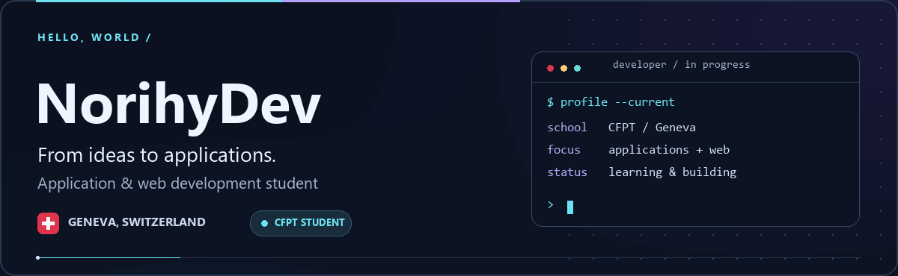
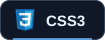
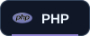
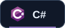
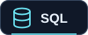

  <picture>
    <source media="(prefers-reduced-motion: reduce) and (max-width: 600px)" srcset="assets/profile-banner-mobile.png">
    <source media="(prefers-reduced-motion: reduce)" srcset="assets/profile-banner.png">
    <source media="(max-width: 600px)" srcset="assets/profile-banner-mobile.gif">
    
  </picture>

  <b>CFPT student &nbsp;·&nbsp; Application &amp; web development &nbsp;·&nbsp; Geneva, Switzerland 🇨🇭</b>

  <a href="https://github.com/NorihyDev?tab=repositories">Explore my repositories ↗</a>
  &nbsp; · &nbsp;
  <a href="https://edurec.ge.ch/site/cfpt-informatique/">Discover CFPT</a>

---

## Hi, I'm NorihyDev 👋

I'm a student at the **Centre de Formation Professionnelle Technique (CFPT)** in **Geneva, Switzerland**, studying **application development**.

I'm learning to turn ideas into useful applications and websites, one project at a time. This profile is where I share my progress as I learn, experiment and build.

## Languages & web technologies

A learning roadmap for application and web development — growing step by step.

  
  
  
  

  
  
  

| Area | Learning focus |
| :--- | :--- |
| **Web** | Page structure, styling, interactivity and server-side development |
| **Applications** | Programming fundamentals, object-oriented design and problem-solving |
| **Data** | Relational databases, queries and connecting data to applications |

## What I'm working towards

- **Build for the web** — clear, responsive interfaces that are easy to use.
- **Create useful applications** — connect logic, APIs and databases.
- **Write better code** — practise debugging, testing and readable documentation.
- **Learn by doing** — keep improving through coursework and personal projects.

  
<b>🇨🇭 En français</b>

### Salut, moi c'est NorihyDev 👋

Je suis étudiant au **CFPT à Genève, en Suisse**, dans la filière **développement d'applications**.

J'apprends à créer des applications et des sites web, à résoudre des problèmes et à écrire du code clair. Ce profil accompagne mon parcours et les projets que je réalise au fil de ma formation.

**Mon parcours d'apprentissage :** HTML, CSS, JavaScript, PHP, C#, Python et SQL.

  
   
  <b>Learn. Build. Improve. Repeat.</b>

<!-- Research and asset credits: docs/profile-notes.md. Technology badges describe a learning roadmap, not a completed qualification or an exhaustive official CFPT language list. -->
